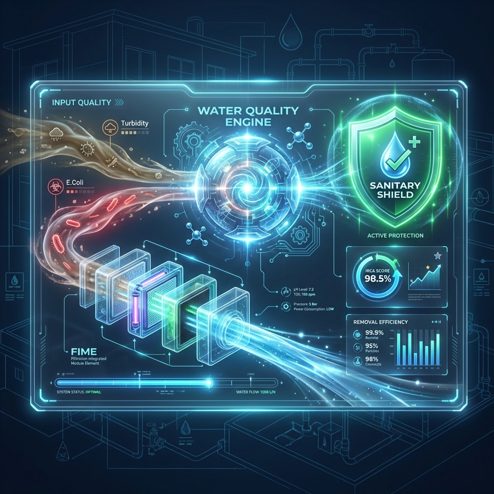
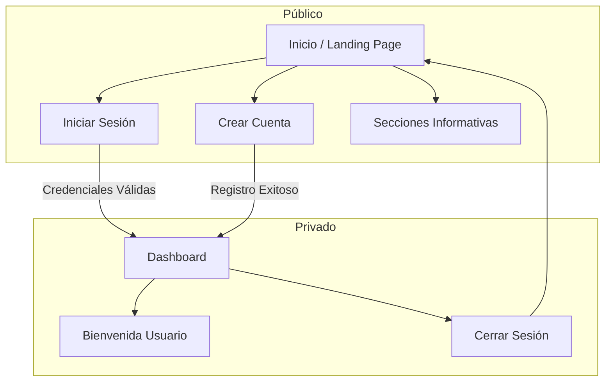

# HYDROSTACK

**Plataforma digital para el diseño y desarrollo de proyectos de agua y saneamiento.**

HYDROSTACK es un entorno integral que acompaña a comunidades, acueductos rurales, ingenieros y empresas en la formulación y gestión de proyectos de agua potable, desde soluciones comunitarias hasta sistemas industriales.



## 🚀 Características

- **Landing Page Profesional**: Diseño minimalista y técnico que comunica la visión y el alcance de la plataforma.
- **Gestión de Identidad**: Sistema de registro e inicio de sesión para múltiples roles (Comunidades, Profesionales, Empresas, ONGs).
- **Dashboard**: Área privada para usuarios autenticados (MVP).
- **Diseño Adaptable**: Interfaz totalmente responsiva construida con Vanilla CSS para un rendimiento óptimo y una estética personalizada.

## 🛠️ Tecnologías

- **Framework**: [Next.js](https://nextjs.org/) (App Router)
- **Lenguaje**: TypeScript
- **Estilos**: Vanilla CSS (CSS Variables & Modules)
- **Autenticación**: Supabase Auth
- **Base de Datos**: Supabase (PostgreSQL) con RLS

## 🗺️ Mapa del Sitio (Sitemap)



## 🏗️ Estructura del Proyecto

Cada proyecto en HydroStack sigue un flujo de trabajo técnico denominado **"Estructura del Proyecto"**, compuesto por **16 módulos** organizados en **7 bloques conceptuales**:

### Bloques Técnicos

| Bloque | Módulos | Propósito |
|--------|---------|-----------|
| **A. Contexto** | 1. Información General | Definir alcance y características del proyecto |
| **B. Demanda** | 2-3. Población y Consumo | Cuantificar beneficiarios y demanda de agua |
| **C. Fuente** | 4-6. Fuente, Consumo y Calidad | Caracterizar la oferta hídrica |
| **D. Hidráulica** | 7-9. Caudales, Almacenamiento y Conducción | Diseñar infraestructura hidráulica |
| **E. Tratamiento** | 10-13. Desarenador, Jarras, Filtros y Compacta | Dimensionar unidades de tratamiento |
| **F. Evaluación** | 14-16. Costos, Viabilidad y Selección | Evaluar viabilidad técnica y económica |
| **G. Documentación** | 📄 Informe Final | Consolidar memoria técnica |

## 🏗️ Principios Arquitectónicos

1. **Flujo Único Universal**: Un solo flujo para todos los tipos de proyecto.
2. **Context over Configuration**: El tipo de proyecto es contexto, no configuración.
3. **Separation of Concerns**: Perfil ≠ Dominio ≠ Contexto ≠ Flujo.

## 📚 Documentación Técnica

Para desarrolladores y contribuidores:

- **[ARCHITECTURE.md](./ARCHITECTURE.md)** — Arquitectura general del sistema.
- **[CONTRIBUTING.md](./CONTRIBUTING.md)** — Guía de contribución y convenciones.
- **[SECURITY.md](./SECURITY.md)** — Política de seguridad.
- **[CHANGELOG.md](./CHANGELOG.md)** — Registro de cambios.
- **[docs/estructura-tecnica.md](./docs/estructura-tecnica.md)** — Clasificación de módulos técnicos.
- **[docs/HYDROSTACK-PROMPT.md](./docs/HYDROSTACK-PROMPT.md)** — Contexto completo para IA.

## 📦 Instalación y Uso

1. **Clonar el repositorio:**
   ```bash
   git clone https://github.com/Lucesdata/hydrostack.git
   cd hydrostack
   ```

2. **Instalar dependencias:**
   ```bash
   npm install
   ```

3. **Iniciar servidor de desarrollo:**
   ```bash
   npm run dev
   ```
   Visita `http://localhost:3000` en tu navegador.

## 📄 Licencia

Este proyecto es propiedad privada. Todos los derechos reservados.
