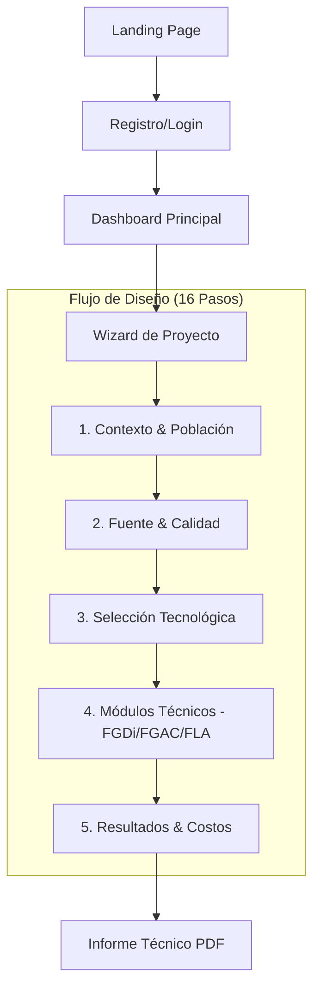
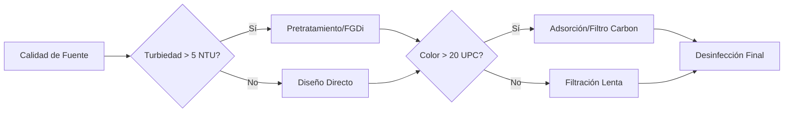

# HYDROSTACK 🛠️💧

**The Industrial SaaS for Rural Water Engineering.**

HYDROSTACK es una plataforma de ingeniería avanzada diseñada para democratizar el acceso a herramientas de diseño profesional. Enfocada inicialmente en sistemas de **Filtración en Múltiples Etapas (FIME)** para comunidades rurales, HydroStack combina el cumplimiento normativo (RAS 0330) con una estética industrial de alto rendimiento.


## 🚀 Características (Industrial SaaS)

- **Interfaz Zero-Scroll**: Layout optimizado para productividad técnica sin distracciones.
- **Cumplimiento Normativo Automatizado**: Motores de cálculo basados en la resolución RAS 0330.
- **Visualización Técnica Premium**: Diagramas y esquemas de ingeniería en tiempo real.
- **Gestión Multi-Perfil**: Flujos optimizados para comunidades, consultores y entidades gubernamentales.

## 🛠️ Tecnologías

- **Framework**: [Next.js](https://nextjs.org/) (App Router & Server Actions)
- **Lenguaje**: TypeScript (Safe-Typing para lógica de ingeniería)
- **Estilos**: Vanilla CSS (Industrial Dark Theme + Glassmorphism)
- **Backend**: Supabase (Auth, DB PostgreSQL, RLS Policies)

## 🗺️ Mapa de Navegación



## 🧠 Flujo de Decisión Técnica (FIME)



## 🏗️ Estructura del Proyecto

Cada proyecto en HydroStack sigue un flujo de trabajo técnico robusto, organizado en **7 bloques técnicos**:

| Bloque | Módulos Clave | Propósito de Ingeniería |
|--------|---------------|-------------------------|
| **A. Contexto** | Información General | Definición de coordenadas y datos base del proyecto. |
| **B. Demanda** | Población y Consumo | Cálculo de dotaciones y variaciones de consumo. |
| **C. Fuente** | Fuente y Calidad | Caracterización físico-química de la captación. |
| **D. Hidráulica** | Caudales y Conducción | Cálculo de pérdidas de energía y diámetros nominales. |
| **E. Tratamiento** | FGDi, FGAC, FLA | Dimensionamiento automatizado de unidades FIME. |
| **F. Evaluación** | Costos y Viabilidad | Análisis de OPEX/CAPEX y matriz de selección. |
| **G. Reporte** | Memoria Técnica | Generación de documento final consolidado. |

## 🏗️ Principios de Diseño

1. **Flujo Único Universal**: Un solo flujo para todos los tipos de proyecto.
2. **Context over Configuration**: El tipo de proyecto es contexto, no configuración.
3. **Separation of Concerns**: Perfil ≠ Dominio ≠ Contexto ≠ Flujo.

## 📚 Documentación Técnica

Para desarrolladores y contribuidores:

- **[ARCHITECTURE.md](./ARCHITECTURE.md)** — Arquitectura general del sistema.
- **[CONTRIBUTING.md](./CONTRIBUTING.md)** — Guía de contribución y convenciones.
- **[SECURITY.md](./SECURITY.md)** — Política de seguridad.
- **[CHANGELOG.md](./CHANGELOG.md)** — Registro de cambios.
- **[docs/estructura-tecnica.md](./docs/estructura-tecnica.md)** — Clasificación de módulos técnicos.
- **[docs/HYDROSTACK-PROMPT.md](./docs/HYDROSTACK-PROMPT.md)** — Contexto completo para IA.

## 📦 Instalación y Uso

1. **Clonar el repositorio:**
   ```bash
   git clone https://github.com/Lucesdata/hydrostack.git
   cd hydrostack
   ```

2. **Instalar dependencias:**
   ```bash
   npm install
   ```

3. **Iniciar servidor de desarrollo:**
   ```bash
   npm run dev
   ```
   Visita `http://localhost:3000` en tu navegador.

## 📄 Licencia

Este proyecto es propiedad privada. Todos los derechos reservados.
