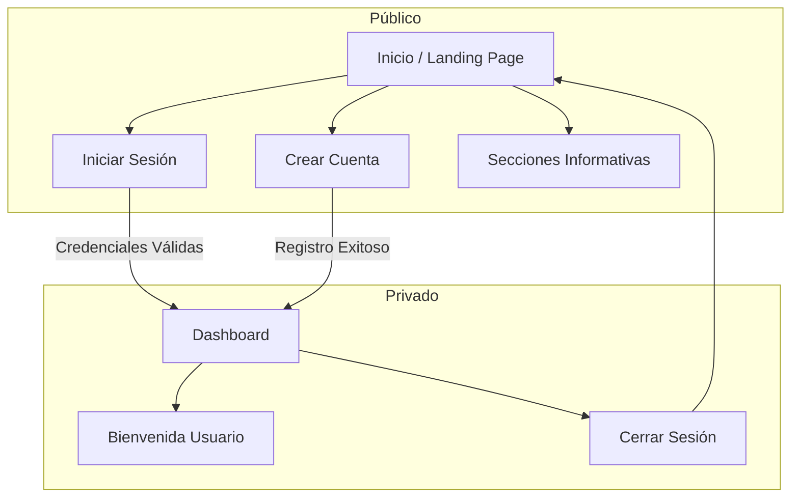

# HYDROSTACK

**Plataforma digital para el diseño y desarrollo de proyectos de agua y saneamiento.**

HYDROSTACK es un entorno integral que acompaña a comunidades, acueductos rurales, ingenieros y empresas en la formulación y gestión de proyectos de agua potable, desde soluciones comunitarias hasta sistemas industriales.

## 🚀 Características

- **Landing Page Profesional**: Diseño minimalista y técnico que comunica la visión y el alcance de la plataforma.
- **Gestión de Identidad**: Sistema de registro e inicio de sesión para múltiples roles (Comunidades, Profesionales, Empresas, ONGs).
- **Dashboard**: Área privada para usuarios autenticados (MVP).
- **Diseño Adaptable**: Interfaz totalmente responsiva construida con Vanilla CSS para un rendimiento óptimo y una estética personalizada.

## 🛠️ Tecnologías

- **Framework**: [Next.js](https://nextjs.org/) (App Router)
- **Lenguaje**: TypeScript
- **Estilos**: Vanilla CSS (CSS Variables & Modules)
- **Autenticación**: Context API + LocalStorage (Simulación cliente para MVP)

## 🗺️ Mapa del Sitio (Sitemap)



## 📦 Instalación y Uso

1. **Clonar el repositorio:**
   ```bash
   git clone https://github.com/Lucesdata/hydrostack.git
   cd hydrostack
   ```

2. **Instalar dependencias:**
   ```bash
   npm install
   ```

3. **Iniciar servidor de desarrollo:**
   ```bash
   npm run dev
   ```
   Visita `http://localhost:3000` en tu navegador.

## 📄 Licencia

Este proyecto es propiedad privada. Todos los derechos reservados.
